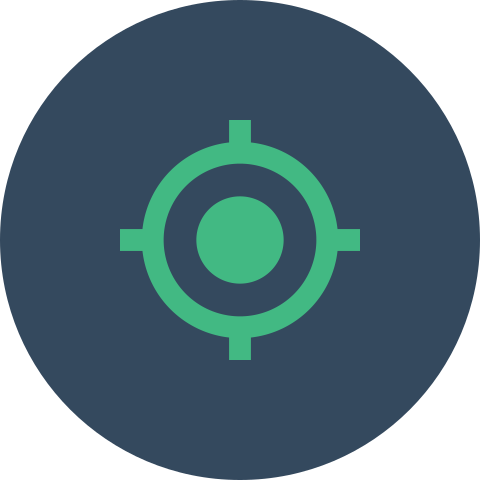

# Geo Cookie plugin for Craft CMS 3.x

Collect information about a visitor's location based on their IP address and store the information as a cookie.

## Requirements

This plugin requires Craft CMS 3.0.0 or later.

## Installation

To install the plugin, follow these instructions.

1. Open your terminal and go to your Craft project:

        cd /path/to/project

2. Then tell Composer to load the plugin:

        composer require lukeyouell/craft-geocookie

3. In the Control Panel, go to Settings → Plugins and click the “Install” button for Geo Cookie.

## Configuring Geo Cookie

#### IP Anonymisation

Anonymisation is the process of turning data into a form which does not identify individuals and where identification is not likely to take place. This allows for a much wider use of the information.

You can toggle this on/off in the CP.

#### API Sources

There are currently 8 different API's to choose from:

- [db-ip.com](https://db-ip.com) (api key required)
- [extreme-ip-lookup.com](https://extreme-ip-lookup.com)
- [freegeoip.net](https://freegeoip.net)
- [ip-api.com](http://ip-api.com)
- [ipapi.co](https://ipapi.co) (default)
- [ipfind.co](https://ipfind.co)
- [ipinfo.io](https://ipinfo.io)
- [ipvigilante.com](https://ipvigilante.com)
- [keycdn.com](https://tools.keycdn.com/geo)

#### API Key

You can supply an API key, should your chosen API source require one.

#### Request Timeout

You can specify the number of seconds to allow for the request to take place before timing out. The default value is 5 seconds.

#### Fallback IP Address

This will be used as the fallback ip address, should the plugin fail to source the user's ip address.

Default value is `8.8.8.8` (Google Inc.)

#### Cookie Name

The default value is `geoCookie` although you can change this to whatever you like.

To purge existing cookies simply change the name of the cookie.

#### Cookie Duration

The user's location is stored in a cookie, you can define the length of time this cookie should exist.

The current options are:

- 1 Hour
- 1 Day
- 1 Week
- 1 Month
- 6 Months
- 1 Year

## Using Geo Cookie

#### Setting the Variable

``

The `location` variable gives you access to the geolocation data.

#### Example Usage

##### JSON Response (ipapi.co)

```json
{
  "ip": "8.8.8.8",
  "city": "Mountain View",
  "region": "California",
  "region_code": "CA",
  "country": "US",
  "country_name": "United States",
  "postal": "94035",
  "latitude": 37.386,
  "longitude": -122.0838,
  "timezone": "America/Los_Angeles",
  "asn": "AS15169",
  "org": "Google Inc."
}
```

##### Usage

| Key          | Usage                       | Output              |
| ------------ | --------------------------- | ------------------- |
| ip           | {{ location.ip }}           | 8.8.8.8             |
| city         | {{ location.city }}         | Mountain View       |
| region       | {{ location.region }}       | California          |
| region_code  | {{ location.region_code }}  | CA                  |
| country      | {{ location.country }}      | US                  |
| country_name | {{ location.country_name }} | United States       |
| postal       | {{ location.postal }}       | 94035               |
| latitude     | {{ location.latitude }}     | 37.386              |
| longitude    | {{ location.longitude }}    | -122.0838           |
| timezone     | {{ location.timezone }}     | America/Los_Angeles |
| asn          | {{ location.asn }}          | AS15169             |
| org          | {{ location.org }}          | Google Inc.         |

##### Caching

If an active cookie matching the cookie name in the settings exists, the plugin will use the location stored within the cookie instead of performing another API request.

To check if a cookie exists simply use `location.cached` which will return a boolean true/false response.

## Example API Responses

#### [db-ip.com](https://db-ip.com)

```json
{
   "ipAddress": "8.8.8.8",
   "continentCode": "NA",
   "continentName": "North America",
   "countryCode": "US",
   "countryName": "United States",
   "stateProv": "California",
   "city": "Mountain View"
}
```

##### [extreme-ip-lookup.com](https://extreme-ip-lookup.com)

```json
{
  "businessName": "",
  "businessWebsite": "",
  "city": "Mountain View",
  "continent": "North America",
  "country": "United States",
  "countryCode": "US",
  "ipName": "google-public-dns-a.google.com",
  "ipType": "Residential",
  "isp": "Google",
  "lat": "37.3860",
  "lon": "-122.0838",
  "org": "Google Inc.",
  "query": "8.8.8.8",
  "region": "California",
  "status": "success"
}
```

##### [freegeoip.net](https://freegeoip.net)

```json
{
  "ip": "8.8.8.8",
  "country_code": "US",
  "country_name": "United States",
  "region_code": "",
  "region_name": "",
  "city": "",
  "zip_code": "",
  "time_zone": "",
  "latitude": 37.751,
  "longitude": -97.822,
  "metro_code": 0
}
```

##### [ip-api.com](http://ip-api.com)

```json
{
  "as": "AS15169 Google Inc.",
  "city": "Mountain View",
  "country": "United States",
  "countryCode": "US",
  "isp": "Google",
  "lat": 37.4229,
  "lon": -122.085,
  "org": "Google",
  "query": "8.8.8.8",
  "region": "CA",
  "regionName": "California",
  "status": "success",
  "timezone": "America/Los_Angeles",
  "zip": ""
}
```

##### [ipapi.co](https://ipapi.co)

```json
{
  "ip": "8.8.8.8",
  "city": "Mountain View",
  "region": "California",
  "region_code": "CA",
  "country": "US",
  "country_name": "United States",
  "postal": "94035",
  "latitude": 37.386,
  "longitude": -122.0838,
  "timezone": "America/Los_Angeles",
  "asn": "AS15169",
  "org": "Google Inc."
}
```

##### [ipfind.co](https://ipfind.co)

```json
{
  "ip_address": "8.8.8.8",
  "country": "United States",
  "country_code": "US",
  "continent": "North America",
  "continent_code": "NA",
  "city": null,
  "county": null,
  "region": null,
  "region_code": null,
  "timezone": null,
  "owner": null,
  "longitude": -97.822,
  "latitude": 37.751,
  "currency": "USD",
  "languages": ["en-US","es-US","haw","fr"]
}
```

##### [ipinfo.io](https://ipinfo.io)

```json
{
  "ip": "8.8.8.8",
  "hostname": "google-public-dns-a.google.com",
  "city": "Mountain View",
  "region": "California",
  "country": "US",
  "loc": "37.3860,-122.0840",
  "org": "AS15169 Google Inc.",
  "postal": "94035",
  "phone": "650"
}
```

##### [ipvigilante.com](https://ipvigilante.com)

```json
{  
  "status": "success",
  "data": {  
    "ipv4": "8.8.8.8",
    "continent_name": "North America",
    "country_name": "United States",
    "subdivision_1_name": "California",
    "subdivision_2_name": null,
    "city_name": "Mountain View",
    "latitude": "37.38600",
    "longitude": "-122.08380"
  }
}
```

##### [keycdn.com](https://tools.keycdn.com/geo)

```json
{
  "status": "success",
  "description": "Data successfully received.",
  "data": {
    "geo": {
      "host": "8.8.8.8",
      "ip": "8.8.8.8",
      "rdns": "google-public-dns-a.google.com",
      "asn": "AS15169",
      "isp": "Google Inc.",
      "country_name": "United States",
      "country_code": "US",
      "region": "",
      "city": "",
      "postal_code": "",
      "continent_code": "NA",
      "latitude": "37.750999450684",
      "longitude": "-97.821998596191",
      "dma_code": "0",
      "area_code": "0",
      "timezone": false,
      "datetime": "na"
    }
  }
}
```

## Overriding Plugin Settings

If you create a [config file](https://craftcms.com/docs/config-settings) in your `config` folder called `geo-cookie.php`, you can override the plugin’s settings in the Control Panel. Since that config file is fully [multi-environment](https://craftcms.com/docs/multi-environment-configs) aware, this is a handy way to have different settings across multiple environments.

Here’s what that config file might look like along with a list of all of the possible values you can override.

```php
<?php

return [
    'logging'        => true,
    'anonymisation'  => true,
    'apiSource'      => 'keycdn',
    'apiKey'         => 'lLyl85arR3nT04T4WDt5AVBJrPTBRjUk',
    'requestTimeout' => 4,
    'fallbackIp'     => '8.8.8.8',
    'cookieName'     => 'geoCookieName',
    'cookieDuration' => 168,
];
```

| Parameter | Expected Value |
| --------- | -------------- |
| `logging` | Boolean |
| `anonymisation` | Boolean |
| `apiSource` | `extremeiplookup`, `freegeoip`, `ipapi`, `ipapi.com`, `ipfind`, `ipinfo`, 'ipvigilante', `keycdn` or `db-ip` |
| `apiKey` | API key for chosen source |
| `requestTimeout` | Integer (seconds) |
| `fallbackIp` | Valid IP address |
| `cookieName` | Cookie name |
| `cookieDuration` | Integer (hours) |

## Debugging

You can dump the API response:

```twig
<pre>{{ location|json_encode(constant('JSON_PRETTY_PRINT')) }}</pre>
```

Errors are now logged. Simply search your logs for `geocookie`.

## Geo Cookie Roadmap

Some things to do, and ideas for potential features:

Brought to you by [Luke Youell](https://github.com/lukeyouell)
